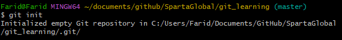
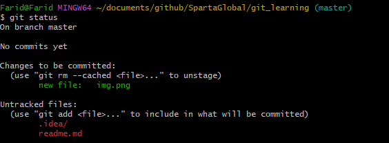

# Git Learning

### What is Version Control?
* A mini file management system where it can see any incremental changes made to the file
* Able to revert changes, which can be good if you want to revert the file to a previous state

## What is Git, and how does it work?
* Not like previous VCS (delta), but Git saves changes as snapshots
* If there were no changes made, Git would link previous file versions instead of storing the new one
* Git allows to view all changes separately, instead having everything as one big change
* Modify, Stage, Commit

## Git Commands:
* **git init** - This initialises the folder as a repository. This creates a new folder, which allows git to manage and track all the changes that occur

* **git status** - Shows the status of the folder/repo (There is no harm in using this command).

* **git add** - After modifying files (Git will know the changes), you have the option to move them over to the "**stage**" process, in which the changes can be tracked  
