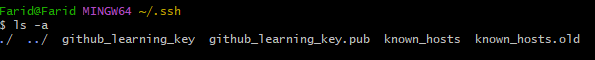

# How to setup a GitHub Repo Using SSH

# Setup
1) Make sure to have a GitHub repository already setup or create a new one if you have not
2) Check if you have a **.ssh** folder in your bash home. You can check this by opening the Git Bash, and typing this command:
```bash
$ls -a # Shows all the hidden files
```
If you do not see a .ssh file, you can create one by typing:
```bash
mkidr .ssh
cd .ssh
```
The **mkdir** command will create the .ssh folder, which is followed by the **cd** command, which will enter the folder.


# Creating Public and Private Keys for SSH
1) Once you are in the .ssh directory. Type in this command:
```bash
ssh-keygen -t rsa -b 4096 -C "your_email@example.com" # This is a placeholder email, make sure to adjust it to your personal email
```
2) Upon entering this command, it will being **generating SSH pair keys**. It will begin prompting you to enter a name for these keys. For the purpose of this tutorial, we will be using the name "**github_learning_key**"


3) When prompted to enter a passphrase, press enter twice to carry on without entering a passphrase and your keys will be generated as files. To display these file, enter the command:
```bash
$ls -a # This will display all the hidden files, include these keys
```


4) We then need the contents of the public key that was created. To do that we would need to enter this command:
```bash
$ cat "NAME_OF_FILE".pub # Replace the caps with the name of the public key, so here it should be called "github_learning_key.pub"
```
This command will output the contents of the public key, which we need to copy and paste. You might notice the last bit of the key contains your email, when copying, make sure there are **no spaces after your email**.

5) Go to your [GitHub](https://www.github.com) repository, and click the setting tab towards the top. On this tab, you will notice a heading under security called "**Deploy Keys**"


6) Towards the top of the page, click the "**add deploy key**" button, which will pop up a new menu. You will be required to add a title, and then paste your key inside the key box (Make sure there are no white spaces after your key). Make sure you **tick the box "Allow Write Access"** as we will need this to push our local repo to GitHub. It will then ask you to authorise by typing your password.


7) Once done, go back to the code heading, and click the green code button, which will show you with a few headings under clone. Ensure you copy the link under the SSH heading. Go back to Git Bash and go back into the directory where you would like to clone the remote repository to.


8) Enter the following command:
```bash
$ eval `ssh-agent` 
```


```bash
$ ssh-add ~/.ssh/github_learning_key # Or the name of the private key you have created in the .ssh folder.
```


```bash
$ ssh -T git@github.com

# Should return this:
# Hi Farid48/tech258_git! You've successfully authenticated, but GitHub does not provide shell access.

```

This will return the file location of the key, as well as the email associated. As the message suggests, these repositories have been linked together using SSH.